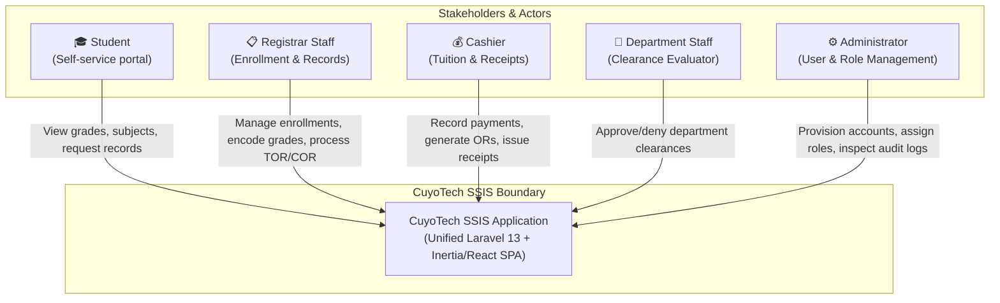
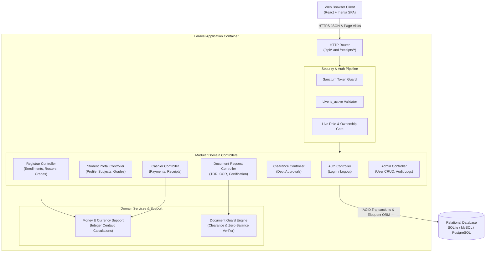
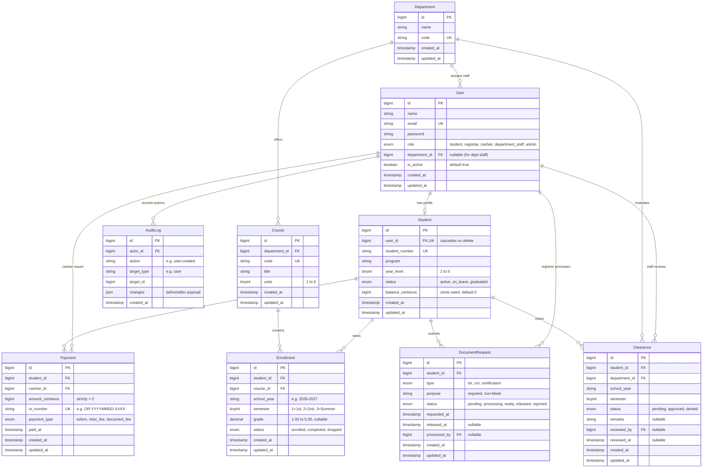
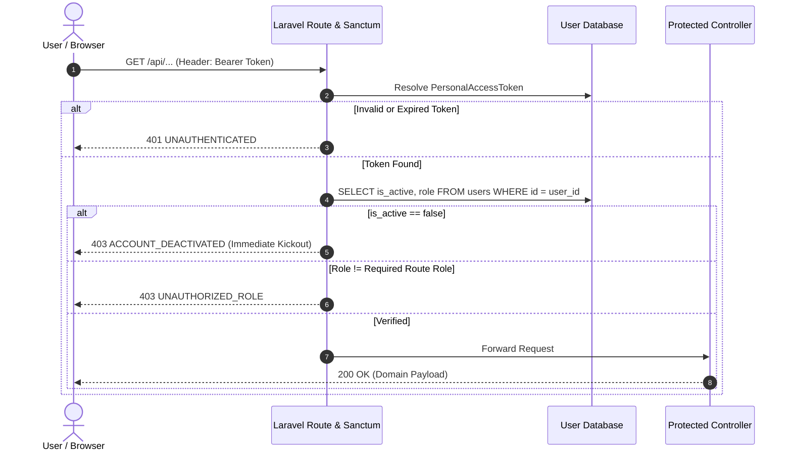
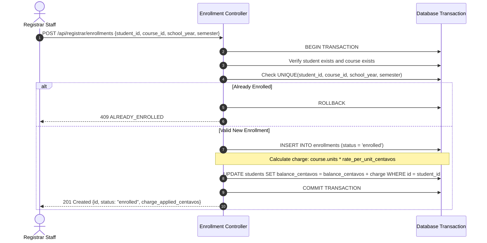
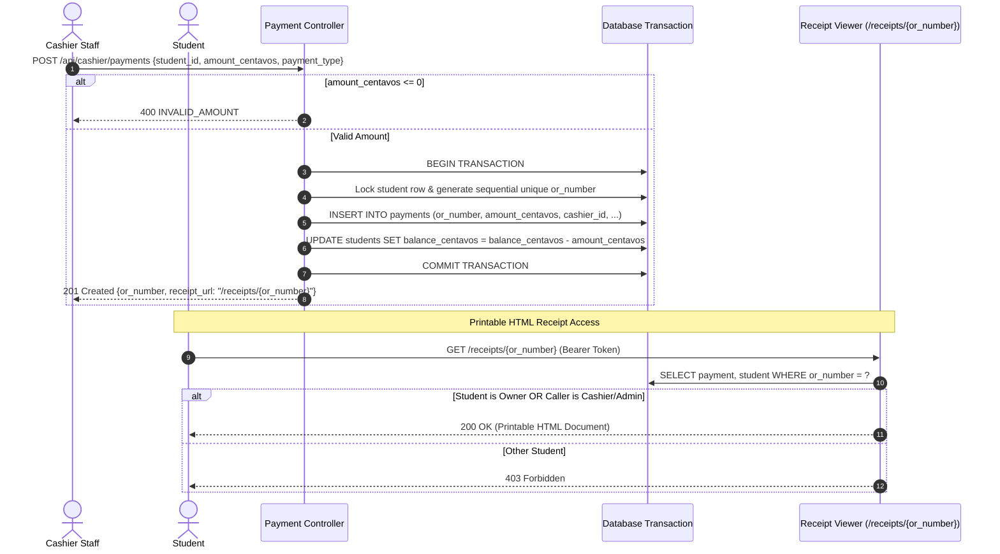
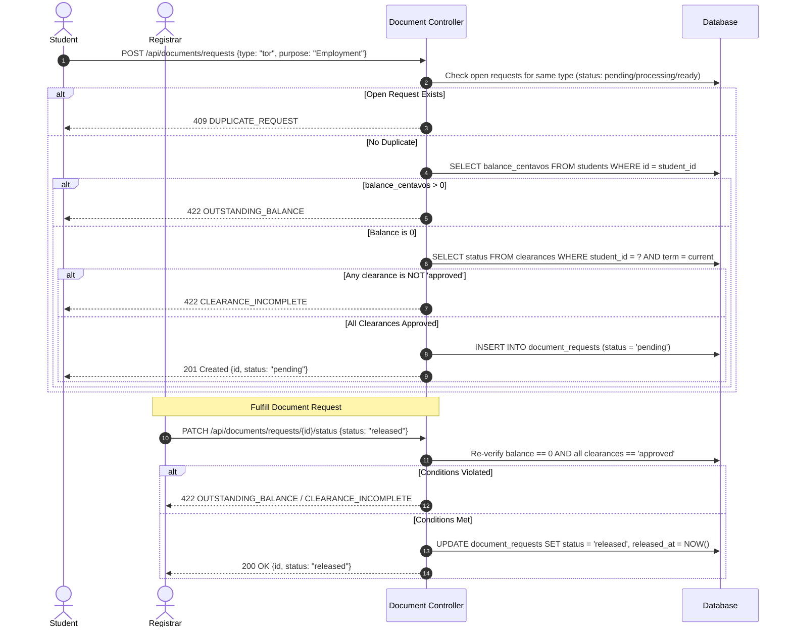
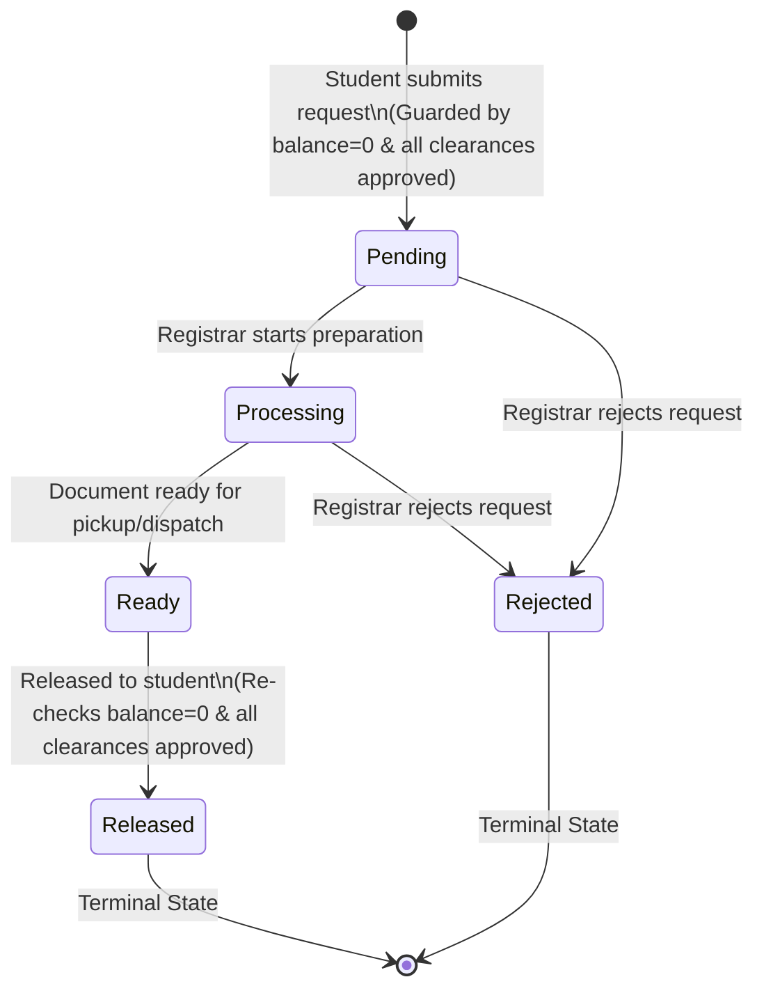
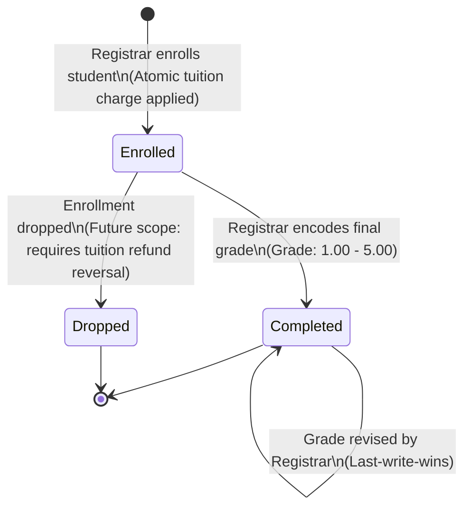
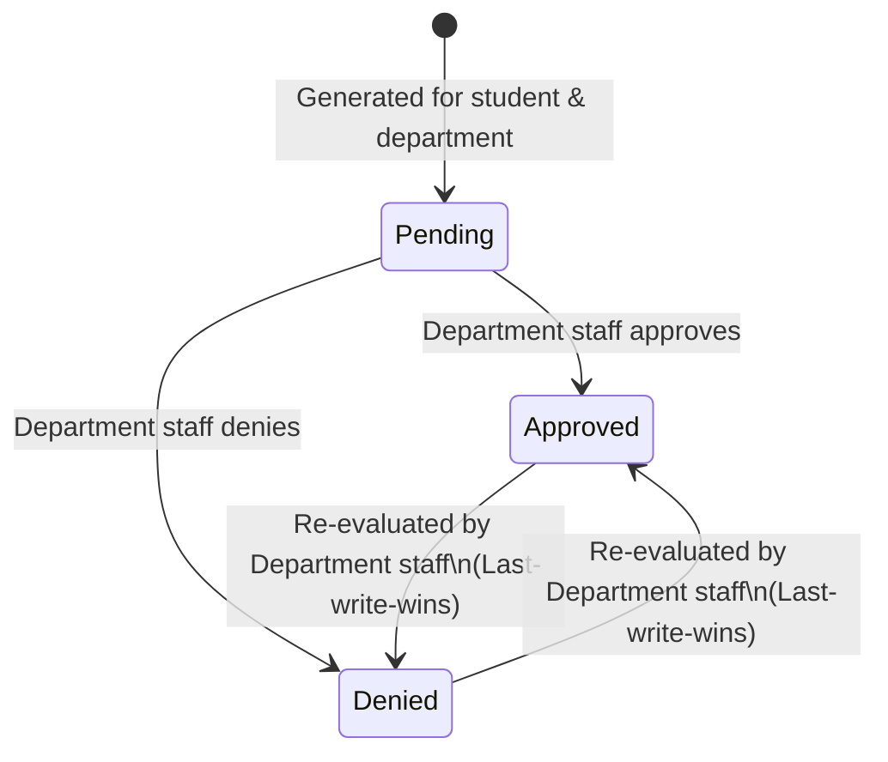

# CuyoTech SSIS — System Modeling & Architecture Specification

> **Target Platform:** Notion & Internal Engineering Docs  
> **System:** CuyoTech University Student Services Information System (SSIS)  
> **Tech Stack:** Laravel 13, PHP 8.3+, React (Inertia.js), Laravel Sanctum, SQLite / Relational DB  
> **Source of Truth:** Aligned with `docs/PRD.md` and `docs/SPEC.md` v1.2

---

## 1. Executive Summary & Context (C4 Level 1)

CuyoTech SSIS is an integrated academic and student services information platform designed to automate university operations across student enrollment, grading, cashiering, departmental clearances, and official document issuance.

---

## 2. Container & Subsystem Architecture (C4 Level 2)

The application follows a monolithic architecture combining client-side Inertia.js React components and server-side Laravel 13 API endpoints within a single deployment unit.

---

## 3. Actor & Role-Based Access Control (RBAC) Matrix

| Module / Operation     | Route / Action                                |     Student      | Registrar | Cashier | Department Staff | Admin |
| :--------------------- | :-------------------------------------------- | :--------------: | :-------: | :-----: | :--------------: | :---: |
| **Authentication**     | `POST /api/login`, `POST /api/logout`         |        ✅        |    ✅     |   ✅    |        ✅        |  ✅   |
| **Student Profile**    | `GET /api/student/profile`                    | ✅ _(Self only)_ |    ❌     |   ❌    |        ❌        |  ❌   |
| **Subjects & Grades**  | `GET /api/student/subjects`, `/grades`        | ✅ _(Self only)_ |    ❌     |   ❌    |        ❌        |  ❌   |
| **Enrollment**         | `POST /api/registrar/enrollments`             |        ❌        |    ✅     |   ❌    |        ❌        |  ❌   |
| **Grade Encoding**     | `PATCH /api/registrar/enrollments/{id}/grade` |        ❌        |    ✅     |   ❌    |        ❌        |  ❌   |
| **Class Roster**       | `GET /api/registrar/courses/{id}/roster`      |        ❌        |    ✅     |   ❌    |        ❌        |  ❌   |
| **Record Payment**     | `POST /api/cashier/payments`                  |        ❌        |    ❌     |   ✅    |        ❌        |  ❌   |
| **Payment History**    | `GET /api/cashier/students/{id}/payments`     |        ❌        |    ❌     |   ✅    |        ❌        |  ✅   |
| **Printable Receipt**  | `GET /receipts/{or_number}`                   |    ✅ _(Own)_    |    ❌     |   ✅    |        ❌        |  ✅   |
| **Dept Clearances**    | `GET /api/department/clearances`              |        ❌        |    ❌     |   ❌    | ✅ _(Own Dept)_  |  ❌   |
| **Student Clearances** | `GET /api/students/{id}/clearances`           | ✅ _(Self only)_ |    ✅     |   ❌    |        ✅        |  ✅   |
| **Review Clearance**   | `PATCH /api/department/clearances/{id}`       |        ❌        |    ❌     |   ❌    | ✅ _(Own Dept)_  |  ❌   |
| **Request Document**   | `POST /api/documents/requests`                |  ✅ _(Guarded)_  |    ❌     |   ❌    |        ❌        |  ❌   |
| **Process Document**   | `PATCH /api/documents/requests/{id}/status`   |        ❌        |    ✅     |   ❌    |        ❌        |  ❌   |
| **Manage Users**       | `POST /api/admin/users`, `PATCH ...`          |        ❌        |    ❌     |   ❌    |        ❌        |  ✅   |
| **Audit Logs**         | `GET /api/admin/audit-logs`                   |        ❌        |    ❌     |   ❌    |        ❌        |  ✅   |

> **Security Invariant:** Roles and `is_active` status are evaluated dynamically on **every HTTP request** from the database record, not from claims cached in bearer tokens. A deactivated account is cut off immediately mid-session.

---

## 4. Domain Data Model & Entity Relationship Diagram (ERD)

### Data Dictionary & Integrity Rules

1. **Monetary Precision Rule:** Floating point numbers are prohibited for financial calculations. All balances, charges, and payments are stored and manipulated as 64-bit integer centavos (`amount_centavos`, `balance_centavos`). UI formatting (`₱1,500.00`) is handled exclusively via formatting accessors.
2. **Tuition Charge Formula:** `charge_applied_centavos = course.units × config('fees.rate_per_unit_centavos')`.
3. **Composite Uniqueness Constraints:**
    - `Enrollment`: `UNIQUE(student_id, course_id, school_year, semester)`
    - `Clearance`: `UNIQUE(student_id, department_id, school_year, semester)`
    - `Student`: `UNIQUE(student_number)`, `UNIQUE(user_id)`
    - `Payment`: `UNIQUE(or_number)`

---

## 5. Dynamic Workflows & Sequence Models

### Workflow A: Live Authentication & Immediate Revocation

---

### Workflow B: Course Enrollment & Balance Assessment Transaction

---

### Workflow C: Cashier Payment & OR Receipt Generation

---

### Workflow D: Document Request & Clearance Verification Pipeline

---

## 6. State Machine & Lifecycle Models

### 6.1 Document Request State Lifecycle (FR-19)

_State Rules:_

- Once in `ready`, `released`, or `rejected`, transitions to any previous state return `409 INVALID_TRANSITION`.
- Transition into `released` unconditionally re-runs clearance and balance invariants.

---

### 6.2 Student Enrollment Lifecycle (FR-5, FR-6)

---

### 6.3 Department Clearance Lifecycle (FR-11)

---

## 7. Key Architectural Invariants & Failure Modes

| Subsystem          | Critical Invariant                                                                    | Failure Mode Prevented                                                                        | Architectural Mitigation                                                                                        |
| :----------------- | :------------------------------------------------------------------------------------ | :-------------------------------------------------------------------------------------------- | :-------------------------------------------------------------------------------------------------------------- |
| **Authentication** | Session validation checks live database row every request.                            | Deactivated user or demoted admin retains access until token expires.                         | Custom middleware checks `users.is_active` and `users.role` on every pipeline cycle.                            |
| **Finance**        | Tuition charge and enrollment record must occur in the exact same DB transaction.     | Student is enrolled for free if app crashes before charge, or charged without being enrolled. | Enclosed in `DB::transaction()`. Any failure rolls back both the enrollment and the balance update.             |
| **Payments**       | OR numbers must be strictly unique and sequential under concurrent cashier writes.    | Race condition where concurrent payments produce conflicting OR numbers.                      | Database transaction with row lock / pessimistic locking on the sequence counter.                               |
| **Documents**      | Students can never initiate or receive documents with debts or unresolved clearances. | Premature release of transcript to delinquent student.                                        | Double-gating: evaluated on `POST /requests` and re-evaluated on `PATCH /status` (`released`).                  |
| **Clearance**      | Staff can only modify clearance records matching their own assigned `department_id`.  | Staff in College of Science approving Library or Accounting clearances.                       | Server-side query scoping: `department_id` is derived from `auth()->user()->department_id`, never from payload. |

---

## 8. Notion Import Guide

To paste this document into **Notion**:

1. Copy the raw markdown content of this file.
2. In Notion, create a new page named **"CuyoTech SSIS — System Modeling"**.
3. Paste directly into the Notion page body.
4. Notion will automatically convert:
    - Headings to H1, H2, and H3 blocks.
    - Tables to native interactive Notion database/tables.
    - Code blocks with `mermaid` syntax to **native interactive visual Mermaid diagram blocks**.
